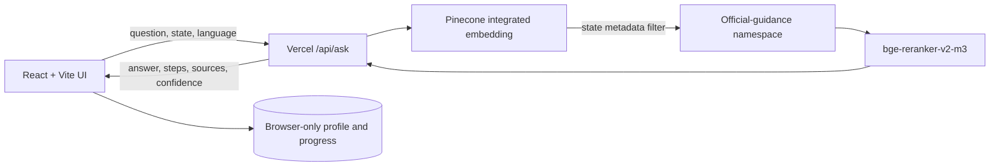

# MigrantLife AI

> A state-aware survival assistant that turns newcomer questions into calm, trackable next steps grounded in official sources.

[](https://migrantlife-ai.vercel.app/)
[](https://www.pinecone.io/)
[](https://vercel.com/)


## What it does

MigrantLife AI helps migrants and newcomers navigate school enrollment, health coverage, driver-license transfers, housing, work, benefits, and scams. A user chooses a state, asks a question naturally, and receives:

- a concise answer and four-step action plan;
- timing or deadline guidance where applicable;
- Pinecone-grounded semantic matches;
- clickable references to original government sources;
- an on-device profile and progress tracker.

The current demo covers **New York, California, Texas, Illinois, and New Jersey** across seven practical topics.

## Architecture



- **Frontend:** React 19, TypeScript, Vite, responsive custom CSS
- **Backend:** Vercel serverless function
- **Retrieval:** Pinecone `multilingual-e5-large`, state filtering, optional `bge-reranker-v2-m3`
- **Knowledge base:** 35 records — 5 states × 7 topics — with official-source metadata
- **Privacy:** no API key in the client; profile and checklist progress remain in local browser storage

## Quick start

Requirements: Node.js 20+, pnpm 11+, and a Pinecone project.

```bash
git clone <your-repository-url>
cd migrantlife-ai
pnpm install
cp .env.example .env.local
```

Set the server-side key in `.env.local`:

```dotenv
PINECONE_API_KEY=replace_with_your_new_key
PINECONE_INDEX=migrantlife-guidance-v1
PINECONE_NAMESPACE=official-guidance-2026
```

Run the full Vercel-compatible application:

```bash
pnpm dev:full
```

For frontend-only design work, use `pnpm dev`. The interface will use its verified local fallback when the serverless API is unavailable.

## Deploy to Vercel

1. Import this repository into Vercel.
2. Keep the detected framework as **Vite**.
3. Add `PINECONE_API_KEY` under **Project Settings → Environment Variables** and mark it sensitive.
4. Optionally add `PINECONE_INDEX` and `PINECONE_NAMESPACE`.
5. Deploy.

The API creates and seeds the configured integrated-embedding index if needed. Never expose the key through a `VITE_*` variable or commit a real `.env` file.

## Useful commands

```bash
pnpm dev          # frontend development
pnpm dev:full     # frontend + Vercel serverless API
pnpm build        # type-check and create production assets
pnpm test         # production build verification
pnpm preview      # preview the built frontend
```

## Repository map

```text
api/ask.ts                    Pinecone retrieval API
src/MigrantLifeApp.tsx        product experience and client state
src/stateData.ts              state rules and official references
src/globals.css               responsive design system
public/                       favicon and social preview
docs/TECHNICAL_OVERVIEW.md    architecture and implementation notes
docs/DEMO_SCRIPT.md           under-five-minute demo script
vercel.json                   production routing and security headers
```

## Safety boundaries

- General navigation information only; not legal, medical, or financial advice.
- The interface asks users not to enter SSNs, case numbers, immigration identifiers, medical records, or document images.
- Eligibility is never guaranteed.
- Time-sensitive decisions link users back to the official agency page.
- A local verified fallback remains available if semantic retrieval is temporarily unavailable.

## Documentation

- [Technical overview](docs/TECHNICAL_OVERVIEW.md)
- [Demo video script](docs/DEMO_SCRIPT.md)
- [Live application](https://migrantlife-ai.vercel.app/)

## License

MIT — see [LICENSE](LICENSE).
